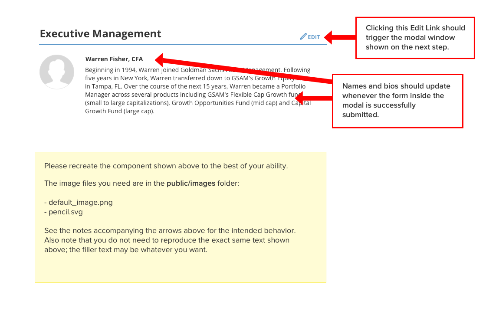
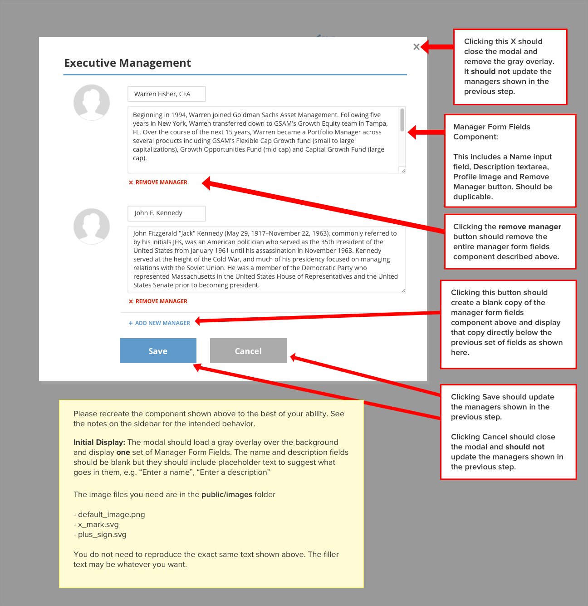

SumZero Front-End Evaluation
=============================

Greetings Fellow Developer!

Welcome to the evaluation. The purpose of this short test is to give us a better sense of how you think as a front-end dev. The test has a four hour time-limit and there's lots for you to work on in that time period. Don't worry about getting the exercise completely, 100% right -- we know this is a timed exercise and we'd like you to work as quickly as you are able, while remaining efficient. Just focus on making sure the code works the way it's intended while making the design look as nice as possible.

A few notes before you begin:

* First things first - run `npm install` to grab all the project dependencies
* For convenience, we've set up a build script and file watcher (webpack) that lets you write JS using ES2015 and React using the npm script included with this repo. Simply run `npm start` from the root directory of the repo and it will watch any js/jsx files in the `assets/js` folder and output them as `public/app_bundle.js` (note that this transpiled file is stored in memory and won't show up in your filesystem). You can also write SCSS in `assets/css/exam.css` if you rename it to .scss
* React and ReactDOM are included with this repo. If you want to use them, just import them into your exam.js file and start Reacting!
* The build script will auto-reload the page when any changes are detected on JS or CSS assets.
* You can use whatever plugins/frameworks you'd like, but try not to use something that completely solves the problem. Remember, we want to get a sense for what your skills are, and importing a bunch of plugin code isn't always going to showcase your JavaScript skills as well as it could.
* Feel free to Google for stuff as needed.

THE MAIN EVENT
----------------------------
You need to create a form within a modal dialog box. The steps and directions to do so are listed on the accompanying image files:

### Step 1

### Step 2

The color palette for the colors used is provided below.

For easy copy/pasting:

**Blue**: #609ACB

**Red**: #D71E00

**Gray**: #AAAAAA

**Black**: #333333

### Baseline Grading

At the very minimum, your code should:

1. Ensure a modal window opens up when the "Edit" link is clicked in Step 1
2. Close the modal window when the Cancel or "X" button is clicked in Step 2
3. Clone the fields when the "Add New Manager" button is clicked in Step 2
4. Update the content on the main page when the "Save" button is clicked in the modal in Step 2

### A Few Extra Notes

* The image files you need for the project are inside the accompanying `./public/images` directory. For the purposes of the exam, they are not part of the build step as css/js are. You can include them the normal way by referencing them in the public folder (e.g. `public/images/default_profile.png`).
* If you need to color SVGs, considering inlining them and changing the "fill" attribute to whatever color you need. Or just make a symbol and reference them through the href attribute.
* Be careful not to overuse more libraries than are necessary. For example, do you really need a complex global state management library for a small exercise like this?
* The text for the two managers is filler text and does not have to match the text shown in the example images, so feel free to use lorem ipsum or other placeholder text instead.
* If you have any questions during the evaluation, feel free to ask one of the developers.

Good luck and happy front-ending!

-- SumZero
